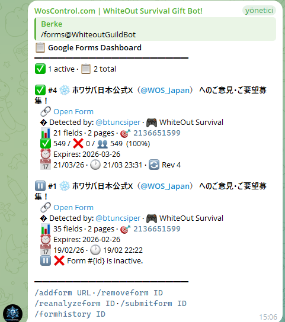

<div align="center">

<a href="https://woscontrol.com">
<h1>🌐 woscontrol.com</h1>
<h3>Whiteout Survival & Kingshot Bot Platform</h3>
</a>

<br>

<a href="https://woscontrol.com">

</a>

<br><br>

# ❄️ WhiteOut Survival Bot

### The Ultimate Gift Code & Alliance Management Bot for WhiteOut Survival

<br>

[](https://t.me/WhiteoutGuildBot)
[](https://discord.com/oauth2/authorize?client_id=1462815590141132905&permissions=8&scope=bot%20applications.commands)
[](https://t.me/btuncsiper)
[](https://t.me/btuncsiper)

<br>

[]()
[](CHANGELOG.md)
[]()
[]()
[]()
[](locales/)
[]()
[](LICENSE)
[]()

<br>

**Automatically discovers and redeems gift codes • Tracks alliance members in real-time**
**Sends furnace, nickname & state change notifications • Works on Telegram and Discord**

<br>

[🌐 Website](#-wos-control-website) · [✨ Features](#-features) · [⚙️ How It Works](#%EF%B8%8F-how-it-works) · [📋 Commands](#-commands) · [🔄 Transfer](#-kingdom-transfer-system) · [🤪 Crazy Joe](#-crazy-joe-event-guide) · [🚀 Get Started](#-get-started) · [🎁 Free Codes](#-get-gift-codes--no-bot-required) · [🤝 Contribute](#-contributing--volunteers-wanted) · [📋 Changelog](CHANGELOG.md) · [❓ FAQ](#-faq)

---

</div>

## ⭐ Source Code Release
> **We're planning to open-source this project!**
> The full source code will be released when this repository reaches **100 ⭐ stars**.
>
> ⭐ **Star this repo** to show your interest and help us reach the goal!
>
> Current progress: 

---

## 🤝 Contributing — Volunteers Wanted!

> **We need your help to keep transfer dates accurate for every state!**

The `/transfer` command shows **real transfer windows** for each state — but keeping these dates up to date requires community support. If you play WhiteOut Survival and know your state's transfer schedule, you can contribute!

### 📅 Transfer Date Contributors Wanted

We are looking for volunteers to report transfer dates for their states. In return:

- 🏆 **Your name (or nickname) will appear in every `/transfer` message** sent by the bot for your state
- 📣 **Credit in the bot's response** — seen by all alliance members who use `/transfer`
- ❤️ Eternal gratitude from the community

### How to Contribute

1. Open the bot: [@WhiteoutGuildBot](https://t.me/WhiteoutGuildBot)
2. Run `/transfer` and check if your state's dates are listed
3. If your state is missing or has incorrect dates, contact us:

<div align="center">

[](https://t.me/btuncsiper)

</div>

> 💡 **What to send:** Your **State number**, current **Generation**, **FC level**, and upcoming **transfer window dates** (with SVS/open transfer phase). Screenshots welcome!

### ✅ Current Contributors

> *Be the first to contribute and get your name here!*
> <!-- Contributors list is updated manually -->

---

## 🔢 Latest Version: v3.3.0

> **Released:** 2026-03-23

  - **Social Media Form Tracker**: Automatic detection and processing of Google Forms shared on official game social media accounts — monitors configured accounts every 15 minutes
  - **Smart AI Filtering**: Advanced AI analysis determines whether a detected form is a genuine reward survey before processing — eliminates irrelevant posts and design events automatically
  - **Auto Form Registration**: Newly discovered forms are instantly analyzed, registered to the database, and submitted to all alliance members without any manual intervention
  - **Configurable Account List**: Easily add or remove monitored social media accounts via config — supports multiple accounts simultaneously

> 📋 **[Full Changelog →](CHANGELOG.md)**

---

## 🎯 What Is This?
**WhiteOut Survival Bot** is a fully automated, production-grade management bot designed specifically for **WhiteOut Survival** alliance leaders and members. It runs **24/7 on a dedicated server**, monitoring official game channels for new gift codes and redeeming them instantly for every registered member in your alliance.

The bot operates on both **Telegram** and **Discord** simultaneously, with a shared database ensuring full cross-platform synchronization. Everything from gift code redemption to member tracking is completely automated — no manual intervention required.

> 💡 **No more missed gift codes.** The bot scans official game sources every **5 minutes**, discovers new codes, validates them, and redeems them for your entire alliance automatically.

---

## 🌐 WOS Control Website

> **Everything in one place** — the bot has a full web platform at **[woscontrol.com](https://woscontrol.com)**

<div align="center">

| Feature | Link | Description |
|---------|------|-------------|
| 🏠 **Home** | [woscontrol.com](https://woscontrol.com) | Overview, features & quick start |
| 🎁 **Gift Codes** | [woscontrol.com/codes](https://woscontrol.com/codes) | Live code list — auto-updated every 5 min |
| 🔍 **Player Lookup** | [woscontrol.com/player-search](https://woscontrol.com/player-search) | Search any player by FID or nickname |
| 📺 **YouTubers** | [woscontrol.com/youtubers](https://woscontrol.com/youtubers) | Featured WOS content creators |
| 📖 **Wiki** | [woscontrol.com/wiki](https://woscontrol.com/wiki) | Game guides, calculators & event info |
| 🤝 **Recruitment** | [woscontrol.com/recruitment](https://woscontrol.com/recruitment) | Alliance recruitment board |
| 💬 **Live Chat** | [woscontrol.com/chat](https://woscontrol.com/chat) | Alliance live chat system |

</div>

### 📸 Screenshots

<div align="center">

 &nbsp; 

 &nbsp; 

 &nbsp; 


</div>


---

## ✨ Features

### 🎁 Automatic Gift Code Redemption
- **Automatic scanning** of official game channels every **5 minutes**
- **Instant validation** against the official WhiteOut Survival API
- **Batch redemption** for all alliance members with **500 concurrent requests** per batch
- **Built-in CAPTCHA solver** — custom ONNX model with **~98% accuracy** (~3.5ms per solve)
- **Smart retry system** with exponential backoff for failed redemptions
- **Per-member tracking** — see exactly which codes succeeded, failed, or were already used
- **Notifications** — new code alerts sent and **pinned** in your group automatically

### 👥 Alliance Member Management
- **Quick registration** — members type `/register [FID]` and they're in
- **DM confirmation** — automatic DM verification for secure registration
- **Cross-game detection** — automatically identifies which game (WOS/Kingshot) a player belongs to
- **Member export** — export your full member list as a file

### 📊 Real-Time Player Monitoring
- **🔥 Furnace level changes** — know when members upgrade their furnace
- **📝 Nickname changes** — track when members change their in-game name
- **🌍 State migrations** — detect when members move to a different state
- **📜 Change history** — view a member's complete change log with `/history`
- **Batch processing** — monitors **500 players concurrently** per cycle

### 🔄 Kingdom Transfer System
- **Power limits** — current caps by generation and furnace level
- **Transfer schedule** — upcoming windows with exact dates
- **Neighborhood groups** — which states can transfer to each other
- **Cost calculator** — estimated transfer cost and alliance store prices
- **Requirements** — all conditions needed to transfer (cooldown, power cap, FC level)

### 🤪 Crazy Joe Event Guide
- **Interactive wave guide** — all 20 waves for difficulty levels 1-11
- **Button navigation** — no typing needed, everything is clickable
- **Point calculator** — compare total points across all difficulties
- **Difficulty recommendation** — based on your alliance's average furnace level
- **Critical wave alerts** — online waves (7, 14, 17) and HQ waves (10, 20)

### 🐻 Event Management & Bear Trap
- **Bear Trap timer** with configurable reminders
- **Custom event scheduling** for your alliance
- **Multi-channel alerts** — notifications in both Telegram and Discord

### 🧮 Game Calculators
- **Troop training & promotion** (T1–T11)
- **Chief Gear upgrades** (Green to Pink, 0–5 stars)
- **Charm upgrades** (Level 0–16)
- **Hero Gear enhancement & mastery** forging

### 🌐 Multi-Platform & Multi-Language
- **Telegram + Discord** — full feature parity, shared database
- **English, Turkish, Russian, Korean** — per-group language configuration
- **Cross-platform sync** — register on Telegram, see data on Discord (and vice versa)
- **🆕 Want to add your language?** Translation files are in [`/locales/`](locales/)

### 👑 Premium & Subscription System
- Tiered plans with configurable member limits
- Subscription expiry warnings (7, 3, 1 day)
- Grace period after expiry (3 days full access)
- Stripe payment integration (optional)

---

## ⚙️ How It Works

### System Architecture
```
┌───────────────────────────────────────────────────────────────────┐
│                    Dedicated Server (24/7)                         │
├───────────────────────────────────────────────────────────────────┤
│                                                                   │
│   📡 Gift Code Scanner            🔄 Member Control Loop          │
│   ┌─────────────────────┐         ┌────────────────────────────┐  │
│   │ Scans official game │         │ Checks every 20 min        │  │
│   │ channels every 5min │         │ 10 players/batch           │  │
│   │ Validates via API   │         │ Detects furnace/name/state │  │
│   │ Auto-redeems codes  │         │ Sends change notifications │  │
│   │ ONNX captcha solver │         │ Updates database           │  │
│   └─────────┬───────────┘         └─────────────┬──────────────┘  │
│             │                                   │                 │
│   ┌─────────▼───────────────────────────────────▼──────────────┐  │
│   │                    PostgreSQL Database                      │  │
│   │  users · alliance_list · gift_codes · user_giftcodes       │  │
│   │  alliancesettings · nickname_changes · furnace_changes     │  │
│   └─────────┬───────────────────────────────────┬──────────────┘  │
│             │                                   │                 │
│   ┌─────────▼───────────┐         ┌─────────────▼──────────────┐  │
│   │   Telegram Bot      │         │     Discord Bot            │  │
│   │   python-telegram-  │         │     discord.py v2          │  │
│   │   bot v21 (async)   │         │     Slash commands         │  │
│   └─────────────────────┘         └────────────────────────────┘  │
│                                                                   │
└───────────────────────────────────────────────────────────────────┘
```

### Gift Code Redemption Flow
```
  Official game channels scanned (every 5 min)
              │
              ▼
     ┌─────────────────┐
     │  New code found  │
     │  & validated     │
     └────────┬────────┘
              │
     ┌────────▼────────┐
     │  Notify all      │──── 📌 Message pinned in group
     │  alliance groups │
     └────────┬────────┘
              │
     ┌────────▼────────┐
     │  Redeem for all  │──── 500 concurrent redemptions/batch
     │  members         │──── ONNX CAPTCHA solver (~98%)
     └────────┬────────┘
              │
       ┌──────┴──────┐
       ▼             ▼
  ┌─────────┐  ┌──────────┐
  │✅ Success│  │❌ Failed  │
  │ Tracked │  │ Queued   │
  │ in DB   │  │ for retry│
  └─────────┘  └──────────┘
```

---

## 📋 Commands

### 👤 Player Commands
| Command | Description |
|---------|-------------|
| `/start` | 🚀 Start the bot and see overview |
| `/help` | ❓ Help and command reference |
| `/register [FID]` | 📝 Register your game account with your FID |
| `/profile` | 👤 View your player profile and stats |
| `/checkuser [FID]` | 🔍 Look up any player by their FID |
| `/codes` | 🎁 View all known gift codes and their status |
| `/language` | 🌐 Change your language preference |
| `/calc` | 🧮 Open game calculators (troops, gear, charms) |
| `/hero` | 🦸 Hero guide, tier list & Bear Trap recommendations |
| `/premium` | 👑 View subscription plan and usage limits |
| `/changelog` | 📋 View bot version history |
| `/support` | 💬 Contact support |

### 🏰 Alliance Management
| Command | Description |
|---------|-------------|
| `/setupalliance` | 🏗️ Create a new alliance (interactive guided setup) |
| `/alliance` | 🏰 View alliance information |
| `/setgroup` | 🔗 Link current group to an alliance |
| `/members [TAG]` | 👥 View all members in an alliance |
| `/export` | 📄 Export member list |

### 👥 Member Operations
| Command | Description |
|---------|-------------|
| `/addmember [FID] [TAG]` | ➕ Add a member to your alliance |
| `/removemember [FID] [TAG]` | ➖ Remove a member |
| `/history [FID]` | 🕵️ View a player's full change history |
| `/delete` | 🗑️ Delete your own account |

### 📅 Events & Tools
| Command | Description |
|---------|-------------|
| `/crazyjoe` | 🤪 Crazy Joe interactive wave guide & calculator |
| `/transfer` | 🔄 Kingdom transfer info, schedule & costs |
| `/beartrap` | 🐻 Bear trap event timer & alerts |
| `/statetimeline` | 🌍 State timeline, generation & events |
| `/announcements` | 📢 Game announcements |

### 🛡️ Admin Tools
| Command | Description |
|---------|-------------|
| `/admins` | 🛡️ Manage alliance admins |
| `/panel` | ⚙️ Alliance control panel |
| `/usecode [CODE]` | 🎫 Manually use a gift code for your alliance |
| `/addcode [CODE]` | 📌 Manually add a gift code |
| `/stats` | 📊 Bot statistics |
| `/broadcast` | 📢 Send announcement to all groups |
| `/managemembers` | 👥 View member gift code eligibility |

---

## 🔄 Kingdom Transfer System

The `/transfer` command provides comprehensive transfer information:

### What It Shows
- **Power Limits** — current caps by generation and furnace level
- **Transfer Schedule** — upcoming windows with exact dates
- **Neighborhood Groups** — which states can transfer to each other
- **Cost Calculator** — estimated transfer cost (Alliance Store, passes)
- **Requirements** — all conditions (cooldown, power cap, FC level, no alliance)

### Transfer Phases
1. **Pre-Transfer (3 days)** — Power caps are set
2. **Invitational Transfer (2 days)** — President sends invites
3. **Open Transfer (2 days)** — Everyone can transfer freely

### Example Output
```
🔄 Kingdom Transfer Info
━━━━━━━━━━━━━━━━━━━━

🏰 State S1234
📅 Server Age: 666 days
⭐ Current Generation: Gen 9
🔜 Next Generation: Gen 10 (41 days)
🏘️ Neighborhood Group: 1183 - 1240
🔄 Transfer Group: 986-1308

⚔️ Current Power Limits
━━━━━━━━━━━━━━━━━━━━
👑 Ordinary: 680m | 🏅 Leading: 372m
🦸 Hero Gen: 9 | 🔥 FC: 10
⚙️ Legendary Gear: ✅ | 🏛️ War Academy: ✅

📅 Next Transfer Dates
━━━━━━━━━━━━━━━━━━━━
✅ Dates You CAN Transfer

🔵 #1 — 27.04.2026 (After SVS)  (34 days)
   🔥 Furnace Requirement: Lv 10
   👑 Ordinary: 790m | Leading: 415m
   🦸 Gen 10 | FC 10 | ⚙️✅ | 🏛️✅
   📋 Transfer Group: 986-1308

🔵 #2 — 25.05.2026 (After SVS)  (62 days)
   🔥 Furnace Requirement: Lv 10
   👑 Ordinary: 790m | Leading: 415m
   🦸 Gen 10 | FC 10 | ⚙️✅ | 🏛️✅
   📋 Transfer Group: 1082-1427

🔵 #3 — 22.06.2026 (After SVS)  (90 days)
   🔥 Furnace Requirement: Lv 10
   👑 Ordinary: 790m | Leading: 415m
   🦸 Gen 10 | FC 10 | ⚙️✅ | 🏛️✅
   📋 Transfer Group: 1190-1552

🔵 #4 — 20.07.2026 (After SVS)  (118 days)
   🔥 Furnace Requirement: Lv 10
   👑 Ordinary: 830m | Leading: 435m
   🦸 Gen 11 | FC 10 | ⚙️✅ | 🏛️✅
   📋 Transfer Group: 986-1308

🔵 #5 — 17.08.2026 (After SVS)  (146 days)
   🔥 Furnace Requirement: Lv 10
   👑 Ordinary: 830m | Leading: 435m
   🦸 Gen 11 | FC 10 | ⚙️✅ | 🏛️✅
   📋 Transfer Group: 1082-1427

💰 Transfer Cost
━━━━━━━━━━━━━━━━━━━━
📊 Transfer Score = Furnace + Gear + Hero + Pet + Expert power (Troop power excluded)
🎫 Cost range: 1-50 Pass
💡 F2P/Low spender typical cost: 6-12 Pass
🏪 Alliance Store: 150K Token

📋 Transfer Requirements
━━━━━━━━━━━━━━━━━━━━
1️⃣ Must not exceed the Power Cap
2️⃣ Must reach required Furnace level (varies with state age)
3️⃣ Must not be in any Alliance
4️⃣ City must not be in combat
5️⃣ 25+ days since last transfer
6️⃣ Target state must have same Hero Gen and FC level
7️⃣ Fewer than 4 characters in target state

📌 Transfer Phases
━━━━━━━━━━━━━━━━━━━━
🔸 Phase 1: Pre-Transfer (3 days) — Power caps are set
🔸 Phase 2: Invitational Transfer (2 days) — President sends invites
🔸 Phase 3: Open Transfer (2 days) — Everyone can transfer

⚠️ What You Lose After Transfer
━━━━━━━━━━━━━━━━━━━━
• Removed from all group chats
• Unsecured resources lost (inventory stays)
• Arena points reset to 1,000
• Pack purchase limits reset

🔄 Migration calculator: /migrate
```

---

## 🤪 Crazy Joe Event Guide

Interactive event guide accessible via `/crazyjoe` with button navigation — **no typing needed**.

### Features
- **📊 Wave Guide** — all 20 waves for each difficulty level (Lv.1-11)
- **📈 Point Calculator** — compare total points across all difficulties with % increase
- **🏆 Difficulty Recommendation** — based on your alliance's average furnace level & member count
- **⚡ Quick Jump** — instant access to critical waves (W7, W10, W14, W17, W20)

### Critical Waves
| Wave | Type | Alert |
|------|------|-------|
| **7, 14, 17** | 🟢 Online Members | All members must be online! |
| **10, 20** | 🏰 HQ Defense | Send reinforcements — no self-defense points |

### Data Coverage
- **11 difficulty levels** with exact troop counts, tier composition, and point values
- **Enemy tier progression**: T1-T2 (Wave 1) → T9-T10 (Wave 20)
- **~11.8% troop increase** per difficulty level
- **~5% point increase** per difficulty level

---

## 🚀 Get Started

### Quick Setup (5 minutes)
**1.** Add the bot to your Telegram group or Discord server
**2.** Run `/setupalliance` and follow the guided setup
**3.** Have your members type `/register [FID]`
**4.** Gift codes are redeemed automatically — sit back and relax! 🎉

### Add to Telegram
[](https://t.me/WhiteoutGuildBot)

> Search for `@WhiteoutGuildBot` in Telegram, add the bot to your alliance group and run `/start`.

### Add to Discord
[](https://discord.com/oauth2/authorize?client_id=1462815590141132905&permissions=8&scope=bot%20applications.commands)

> Click the button above to invite the bot. Use `/start` in your server to begin.

### 🆓 Free Trial
Contact us for a **free trial** with full access to all features:

[](https://t.me/btuncsiper)

---

## 🎁 Get Gift Codes — No Bot Required

Don't have the bot set up yet? You can still get **WhiteOut Survival gift codes** redeemed for your account instantly.

<div align="center">

[](https://t.me/btuncsiper)

[](https://woscontrol.com/codes)

</div>

> 📋 **How it works:**
> 1. Find all active codes at **[woscontrol.com/codes](https://woscontrol.com/codes)**
> 2. Contact [@btuncsiper](https://t.me/btuncsiper) on Telegram with your **FID**
> 3. All active gift codes get redeemed for your account — instantly, no registration needed
> 4. Add the bot to your alliance group for permanent, fully automatic redemption 🚀

---

## 📖 Guides

### How to Find Your FID
Your **FID (Fighter ID)** is your unique player identifier in WhiteOut Survival.

1. Open **WhiteOut Survival**
2. Tap your **avatar** in the top-left corner
3. Your **FID** is displayed below your nickname

> 💡 Your FID is a number like `123456789`. Copy it and use `/register 123456789` to register with the bot.

---

## 🛠 Tech Stack

| Component | Technology | Details |
|-----------|-----------|---------|
| **Language** | Python 3.13+ | Fully async/await architecture |
| **Telegram API** | python-telegram-bot v21 | Async-native, conversation handlers |
| **Discord API** | discord.py v2.x | Slash commands, embeds, views |
| **Database** | PostgreSQL 15+ | Connection pooling, composite keys |
| **HTTP Client** | aiohttp | Async API calls, session management |
| **CAPTCHA Solver** | ONNX Runtime (local) | Custom model, ~98% accuracy, ~3.5ms |
| **Proxy** | Residental rotating proxies | Rate limit avoidance |
| **Hosting** | Dedicated Server | 24/7 uptime, Windows Server |
| **Payments** | Stripe (optional) | Subscription management |

### Performance Configuration
| Parameter | Value | Description |
|-----------|-------|-------------|
| Gift Code Scan Interval | **5 minutes** | How often new codes are checked |
| Member Check Interval | **20 minutes** | Default alliance monitoring interval |
| API Batch Size | **500 concurrent** | Player data fetch parallelism |
| Gift Code Batch Size | **500 concurrent** | Code redemption parallelism |
| CAPTCHA Solve Time | **~3.5ms** | Local ONNX model inference |

### Architecture Highlights
- **Single-process dual-bot** — Telegram and Discord run concurrently in one process
- **Shared PostgreSQL database** — full cross-platform data consistency
- **Modular design** — separate modules for registration, gift codes, control, alliance, events, premium
- **Multi-language locale system** — JSON-based, per-group language settings (EN/TR/RU)
- **Game-type awareness** — all operations scoped by game type for multi-game support
- **Auto GitHub sync** — README, changelog, and locales auto-pushed on version change

---

## 🌐 Supported Languages

| Language | Code | Status |
|----------|------|--------|
| 🇬🇧 English | `en` | ✅ Full |
| 🇰🇷 한국어 | `ko` | ✅ Full |
| 🇷🇺 Русский | `ru` | ✅ Full |
| 🇹🇷 Türkçe | `tr` | ✅ Full |

Language files are in the [`locales/`](locales/) directory.

> 🆕 **Want to add your language?** Fork the repo, copy `locales/en.json`, translate it, and submit a PR!

---

## ❓ FAQ
<details>
<summary><b>How do I find my FID (Fighter ID)?</b></summary>

Open WhiteOut Survival → Tap your avatar (top-left corner) → Your FID is displayed below your nickname. It's a number like `123456789`.
</details>

<details>
<summary><b>Is this bot safe to use?</b></summary>

Absolutely. The bot uses the **official gift code redemption API** — the exact same API that the game's own website uses. It does **not** access your game account, modify your game data, or require your password.
</details>

<details>
<summary><b>How often does the bot check for new gift codes?</b></summary>

Every **5 minutes**. When a new code is discovered, it is validated and redeemed for all registered members within minutes.
</details>

<details>
<summary><b>Can I use this bot for multiple alliances?</b></summary>

Yes! Each alliance has its own configuration, member list, monitoring interval, language setting, and notification channels. Premium plans allow managing more alliances with higher member limits.
</details>

<details>
<summary><b>What languages are supported?</b></summary>

**English**, **Turkish** (Türkçe), and **Russian** (Русский). Each group can independently set their preferred language.
</details>

<details>
<summary><b>Does this bot work on both Telegram and Discord?</b></summary>

Yes! The bot runs on both platforms simultaneously with a shared database. Register on Telegram and your data is available on Discord too.
</details>

---

## 📞 Contact & Support
[](https://t.me/btuncsiper)

- **Support**: [t.me/btuncsiper](https://t.me/btuncsiper)
- **Bot**: [@WhiteoutGuildBot](https://t.me/WhiteoutGuildBot)
- **Free Trial**: [Request here](https://t.me/btuncsiper)

---

## 📄 License
This project is licensed under the MIT License — see the [LICENSE](LICENSE) file for details.

---

<div align="center">

<a href="https://woscontrol.com">

</a>

<br><br>

**v3.3.0** · Last updated: 2026-03-23

<br>

[](https://t.me/WhiteoutGuildBot)
[](https://discord.com/oauth2/authorize?client_id=1462815590141132905&permissions=8&scope=bot%20applications.commands)
[](https://t.me/btuncsiper)
[](LICENSE)

<br>

**WhiteOut Survival** · **WOS Bot** · **Gift Code Bot** · **Alliance Management** · **Auto Redeem**
**Telegram Bot** · **Discord Bot** · **Free Gift Codes** · **Furnace Tracker** · **WOS Helper**

</div>
